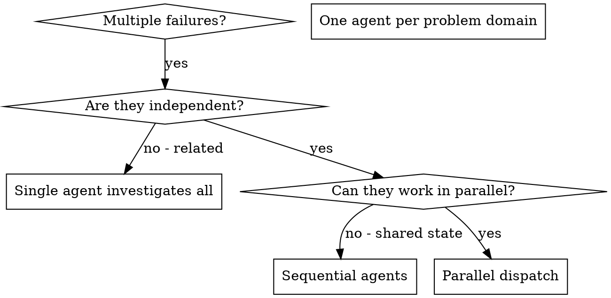

# Dispatching Parallel Agents

## Overview

You delegate tasks to specialized agents with isolated context. By precisely crafting their instructions and context, you ensure they stay focused and succeed at their task. They should never inherit your session's context or history — you construct exactly what they need. This also preserves your own context for coordination work.

When you have multiple unrelated failures (different test files, different subsystems, different bugs), investigating them sequentially wastes time. Each investigation is independent and can happen in parallel.

**Core principle:** Dispatch one agent per independent problem domain. Let them work concurrently.

**Important expansion:** “Parallel dispatch” is not only subagents. In a Codex-style environment you usually have *three* parallelism levers, in increasing cost/risk:

1. **Parallel local tool calls** (fastest, lowest risk): use `multi_tool_use.parallel` to run multiple independent `exec_command` calls at once (search/read/inspect).
2. **Batched external research** (medium): batch multiple web queries into one tool call when possible (so unrelated searches don’t serialize).
3. **Subagents / isolated work** (highest leverage): dispatch agents with explicit, disjoint scope (and ideally disjoint write sets or worktrees).

Use the cheapest lever that achieves the goal. Escalate only when you need independent reasoning, long-running work, or separate ownership.

## When to Use



**Use when:**
- 3+ test files failing with different root causes
- Multiple subsystems broken independently
- Each problem can be understood without context from others
- No shared state between investigations
- You need to run 2+ independent repo inspections (e.g., multiple `rg`/`ls`/`cat`) that do not depend on each other
- You want governance/notes/script drafting to happen *without blocking* the main debugging/build loop

**Don't use when:**
- Failures are related (fix one might fix others)
- Need to understand full system state
- Agents would interfere with each other
- The next action depends on the output of the previous command (sequential dependency)

## The Pattern

### 1. Identify Independent Domains

Group failures by what's broken:
- File A tests: Tool approval flow
- File B tests: Batch completion behavior
- File C tests: Abort functionality

Each domain is independent - fixing tool approval doesn't affect abort tests.

**Tool-parallel equivalent:** this same “domain split” is how you decide what to run inside `multi_tool_use.parallel`:

- Domain A command set (search + read + inspect) should not depend on Domain B outputs
- Domain B command set can run at the same time
- Domain C command set can run at the same time

### 2. Create Focused Agent Tasks

Each agent gets:
- **Specific scope:** One test file or subsystem
- **Clear goal:** Make these tests pass
- **Constraints:** Don't change other code
- **Expected output:** Summary of what you found and fixed

**Tool-parallel equivalent:** each “task” becomes a single command (or small chain) that produces one artifact:

- a list of matching files (`rg`)
- a focused file excerpt (`sed -n ...`)
- a directory view (`ls`)
- a targeted test run (`pytest path::test_name`)

Avoid chaining commands that depend on previous outputs inside the same parallel batch.

### 3. Dispatch in Parallel

```typescript
// In Claude Code / AI environment
Task("Fix agent-tool-abort.test.ts failures")
Task("Fix batch-completion-behavior.test.ts failures")
Task("Fix tool-approval-race-conditions.test.ts failures")
// All three run concurrently
```

#### 3A. Dispatch parallel *tools* (`multi_tool_use.parallel`)

Use this when you don’t need independent reasoning contexts, just faster I/O and evidence collection.

**Good fits:**
- Multiple independent `rg` searches (different subsystems, different symbols)
- Reading multiple files you already know you need
- Collecting environment context (`git status`, `ls`, `cat` of config files)

**Avoid:**
- `apply_patch` (writes) in the same batch
- commands that modify shared working-tree state (`git checkout`, `git reset`, `git clean`)
- commands that contend on shared resources (ports, locks, temp files, output logs)

**Shape (Codex):**

```json
{
  "tool_uses": [
    {
      "recipient_name": "functions.exec_command",
      "parameters": { "cmd": "rg -n \"pendingToolCount\" -S src" }
    },
    {
      "recipient_name": "functions.exec_command",
      "parameters": { "cmd": "rg -n \"abort\" -S src/agents" }
    },
    {
      "recipient_name": "functions.exec_command",
      "parameters": { "cmd": "git status --porcelain && git rev-parse --short HEAD" }
    }
  ]
}
```

You then integrate results the same way you integrate subagents: summarize, decide the next serial step, then patch.

#### 3C. Parallelize *code changes* safely (disjoint ownership)

Sometimes you already know the changes needed across multiple files and the work is independent. Parallelism is still possible, but you must respect write-conflict constraints.

**Preferred options (lowest conflict first):**

1. **One patch, many files (batched write):** generate a single `apply_patch` that updates multiple files at once. This is not “parallel”, but it avoids interleaving and keeps the change coherent.
2. **Subagents with disjoint write sets:** assign each agent explicit file ownership (File A only, File B only, etc.), then integrate sequentially in the main lane.
3. **Isolated worktrees per agent:** if changes touch related areas but need parallel execution, isolate by worktree so agents don’t contend on one working tree.

**Avoid:** trying to run multiple `apply_patch` operations concurrently. Even if files are disjoint, tooling and review become error-prone.

#### 3B. Dispatch parallel *web research* (batching)

If you’re using a web-search / MCP tool that supports multiple queries in one call, batch unrelated queries together:

- Query A: error string / stack trace
- Query B: API doc lookup
- Query C: upstream issue/PR search

Goal: reduce “search → wait → search → wait” serialization when the queries are independent.

If the tool does *not* support batching, still pre-plan all independent queries up front so you don’t accidentally serialize by “thinking of the next query only after the previous one returns”.

### 4. Review and Integrate

When agents return:
- Read each summary
- Verify fixes don't conflict
- Run full test suite
- Integrate all changes

**Tool-parallel equivalent:** after a `multi_tool_use.parallel` batch returns:

- consolidate findings into one short “evidence table” (domain → key clues → next action)
- pick *one* next serial action (usually a patch) and do it
- then run a targeted validation

## Codex Subagent Dispatch Rules (Governance-Aligned)

These rules are extracted from `~/.agents/AGENTS.md` and belong here because they directly affect whether parallel subagent work is safe and low-conflict.

**Use subagents only for bounded, low-conflict work**, for example:
- test and log analysis
- environment inspection
- command and result summarization
- governance note drafting
- reference extraction
- candidate script drafting

**When dispatching subagents, always specify:**
- how work is divided (A/B/C scopes)
- which agent owns which output (file paths or artifacts)
- whether all subagents must finish before synthesis
- what summary format you expect back in the main thread

**Avoid parallel subagents for overlapping write-heavy changes** unless you have:
- strict file ownership (disjoint write sets), or
- isolated worktrees per agent

**If the main lane is blocked** (build/tests/downloads/polling), use that time for governance sidecar tasks, but do not edit the same files concurrently.

## Async Sidecar Lane (Non-Blocking Subtasks)

This skill is about parallelism; a common missing pattern is **asynchronous sidecar work** that should *not* block the main lane.

**Use a sidecar lane for tasks like:**
- capturing errors/workarounds into `.worklog/`
- drafting a reusable script for repeated commands
- extracting “decision rules” into skill references
- summarizing long logs while a build/test runs

**How to run sidecar work safely:**

- **If a long-running command can be backgrounded**, start it in the background and write logs to a dedicated file, then keep working.
- **If subagents are available**, dispatch one subagent with *explicit ownership* of governance artifacts (notes only; no overlapping code edits).
- **Never** have sidecar work edit the same files the main lane is editing.

**Policy constraint:** if the environment forbids subagents, the sidecar lane still exists — it just becomes “do governance after each long-running command starts/finishes”, not “delegate to another agent”.

## Agent Prompt Structure

Good agent prompts are:
1. **Focused** - One clear problem domain
2. **Self-contained** - All context needed to understand the problem
3. **Specific about output** - What should the agent return?

```markdown
Fix the 3 failing tests in src/agents/agent-tool-abort.test.ts:

1. "should abort tool with partial output capture" - expects 'interrupted at' in message
2. "should handle mixed completed and aborted tools" - fast tool aborted instead of completed
3. "should properly track pendingToolCount" - expects 3 results but gets 0

These are timing/race condition issues. Your task:

1. Read the test file and understand what each test verifies
2. Identify root cause - timing issues or actual bugs?
3. Fix by:
   - Replacing arbitrary timeouts with event-based waiting
   - Fixing bugs in abort implementation if found
   - Adjusting test expectations if testing changed behavior

Do NOT just increase timeouts - find the real issue.

Return: Summary of what you found and what you fixed.
```

## Common Mistakes

**❌ Too broad:** "Fix all the tests" - agent gets lost
**✅ Specific:** "Fix agent-tool-abort.test.ts" - focused scope

**❌ No context:** "Fix the race condition" - agent doesn't know where
**✅ Context:** Paste the error messages and test names

**❌ No constraints:** Agent might refactor everything
**✅ Constraints:** "Do NOT change production code" or "Fix tests only"

**❌ Vague output:** "Fix it" - you don't know what changed
**✅ Specific:** "Return summary of root cause and changes"

**❌ Treating `spawn_agent(model=...)` as the main model-selection path:** Can fail if the runtime ignores or restricts subagent model overrides
**✅ Default to runtime choice when you do not care:** Omit `model`
**✅ Use a named custom agent when you do care:** Pin `model` in `agents.<name>.config_file` instead of relying on per-call overrides (see `references/subagent-model-override.md`)

## When NOT to Use

**Related failures:** Fixing one might fix others - investigate together first
**Need full context:** Understanding requires seeing entire system
**Exploratory debugging:** You don't know what's broken yet
**Shared state:** Agents would interfere (editing same files, using same resources)

## Real Example from Session

**Scenario:** 6 test failures across 3 files after major refactoring

**Failures:**
- agent-tool-abort.test.ts: 3 failures (timing issues)
- batch-completion-behavior.test.ts: 2 failures (tools not executing)
- tool-approval-race-conditions.test.ts: 1 failure (execution count = 0)

**Decision:** Independent domains - abort logic separate from batch completion separate from race conditions

**Dispatch:**
```
Agent 1 → Fix agent-tool-abort.test.ts
Agent 2 → Fix batch-completion-behavior.test.ts
Agent 3 → Fix tool-approval-race-conditions.test.ts
```

**Tool-parallel variant (no subagents):** first collect evidence for each domain in one batch, then choose one serial fix.

```json
{
  "tool_uses": [
    {
      "recipient_name": "functions.exec_command",
      "parameters": { "cmd": "rg -n \"abort\" -S src/agents && sed -n '1,200p' src/agents/agent-tool-abort.test.ts" }
    },
    {
      "recipient_name": "functions.exec_command",
      "parameters": { "cmd": "rg -n \"batch\" -S src && sed -n '1,200p' src/agents/batch-completion-behavior.test.ts" }
    },
    {
      "recipient_name": "functions.exec_command",
      "parameters": { "cmd": "rg -n \"approval\" -S src && sed -n '1,200p' src/agents/tool-approval-race-conditions.test.ts" }
    }
  ]
}
```

**Results:**
- Agent 1: Replaced timeouts with event-based waiting
- Agent 2: Fixed event structure bug (threadId in wrong place)
- Agent 3: Added wait for async tool execution to complete

**Integration:** All fixes independent, no conflicts, full suite green

**Time saved:** 3 problems solved in parallel vs sequentially

## Key Benefits

1. **Parallelization** - Multiple investigations happen simultaneously
2. **Focus** - Each agent has narrow scope, less context to track
3. **Independence** - Agents don't interfere with each other
4. **Speed** - 3 problems solved in time of 1

## Verification

After agents return:
1. **Review each summary** - Understand what changed
2. **Check for conflicts** - Did agents edit same code?
3. **Run full suite** - Verify all fixes work together
4. **Spot check** - Agents can make systematic errors

## Real-World Impact

From debugging session (2025-10-03):
- 6 failures across 3 files
- 3 agents dispatched in parallel
- All investigations completed concurrently
- All fixes integrated successfully
- Zero conflicts between agent changes

## References

- `references/subagent-model-override.md` - Why `spawn_agent.model` can break and when to omit it
- `references/multi_tool_use-parallel.md` - What to batch with `multi_tool_use.parallel` (and what to serialize)
