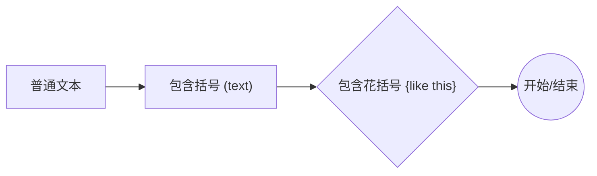
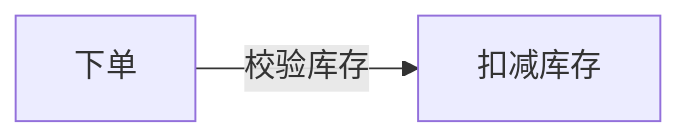
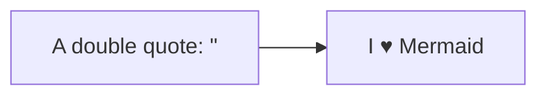

# Mermaid 防坑规则速查

> 目标：让 Mermaid 一次渲染成功。

## 1) 节点文字：一律用双引号包起来

✅ 推荐（稳）：



❌ 易炸（尤其文本里有括号、冒号、引号等）：

```mermaid
flowchart LR
  b[包含括号 (text)]
```

## 2) 边的文字：一律也用双引号



## 3) 引号/特殊字符：用 entity code

Mermaid 支持 `#...;` 这种 entity code。

- `"` → `#quot;`
- `#` → `#35;`
- `;` → `#59;`（特别是 sequenceDiagram 的消息文本里）

示例：



（如果你真的需要编码更多字符：`[` → `#91;`，`]` → `#93;`，`{` → `#123;`，`}` → `#125;`）

## 4) ID 规则（强制）

- 只能用：字母/数字/下划线
- 不要用中文、空格、标点
- 推荐：`n1`, `n2`, `svc_api`, `db_main`

## 5) 常见坑（flowchart）

- `end` 作为节点/文本（全小写）可能会触发解析问题 → 写成 `End`/`END` 更安全。
- 连线里 `---o` / `---x` 这种开头有特殊含义，别误触发。

## 6) 最快自检

- 有没有任何 `[...] / (...) / {...}` 里面是 **没引号** 的文字？有就全加上。
- 文本里有没有 `"`？有就改成 `#quot;`。
- 括号是否成对？
